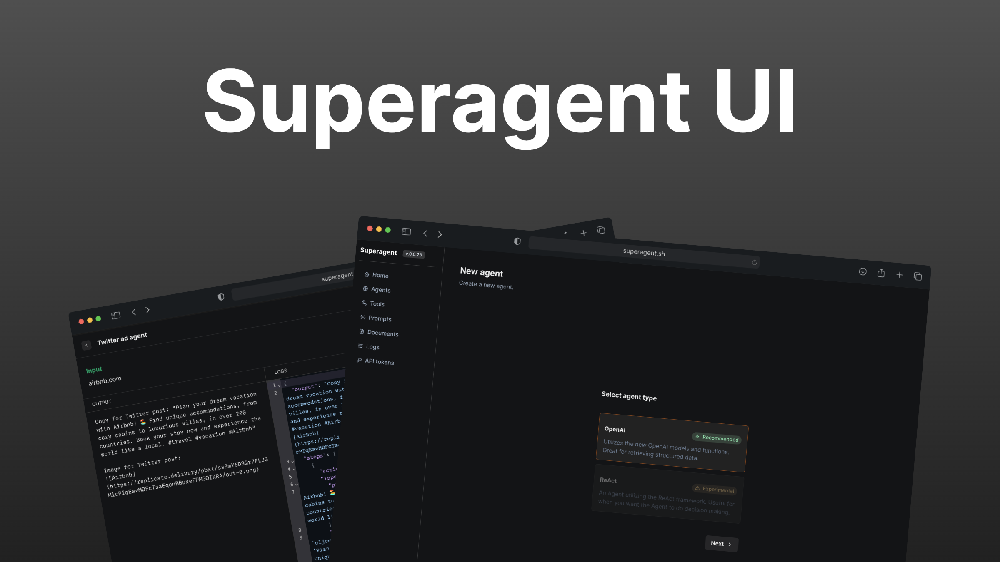

<div align="center">

# Superagent 🥷

**Build, deploy, and manage LLM-powered agents**
[Superagent.sh](https://Superagent.sh)

<p>


</p>



</div>

## 🧐 What is this?

Superagent provides a GUI which makes it easy for anyone to manage agents, documents, prompts etc. through a no-code interface.

## 🥷 Superagent Cloud

If you are looking for a plug-n-play way getting started be sure to checkout [Superagent.sh](https://Superagent.sh).

## 🔎 Documentation

Checkout the [full documentation here](https://docs.Superagent.sh/).

## 🚧 Roadmap

You can follow the [roadmap here](https://github.com/users/homanp/projects/4)

## 🛠️ Getting Started

To get started with Superagent UI, follow these steps:

1. Clone the Superagent repository into a public GitHub repository or fork it from [https://github.com/homanp/Superagent/fork](https://github.com/homanp/Superagent/fork). If you plan to distribute the code, keep the source code public.

   ```sh
   git clone https://github.com/homanp/Superagent.git
   ```

2. Go tho the `ui` folder:

   ```sh
   cd ui
   ```

3. Go tho the `ui` folder:

   ```
   rename `.env-example` to `.env` and fill in all variables.
   ```

4. Install dependencies:

   ```sh
   npm i
   ```

5. Run dev server:
   ```sh
   npm run dev
   ```

## 🫶 Contributions

Superagent is an open-source project, and contributions are welcome. If you would like to contribute, you can create new features, fix bugs, or improve the infrastructure. Please refer to the [CONTRIBUTING.md](https://github.com/homanp/Superagent/blob/main/.github/CONTRIBUTING.md) file in the repository for more information on how to contribute.

We appreciate your contributions and aim to make it easy for anyone to create and run LLM Agents in production using Superagent.

## 🙏 Support

We appreciate all the support you can give us, either with contributions, feedback, bug reports or feature requests. Drop a star and share Superagent to the world!
